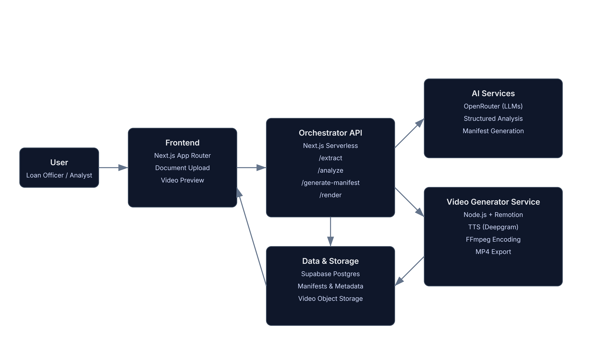

# 🏦 Loanie  
**Loan Intelligence, Explained Clearly**


---

## 📌 What is Loanie?

**Loanie** is an AI-assisted loan intelligence platform that converts complex loan documents into **standardized, institution-grade video briefings**, helping banks make faster, clearer, and more consistent lending decisions.

Instead of reading hundreds of pages of credit memos, financials, and transcripts, decision-makers receive a **2–3 minute briefing video** that explains the credit story clearly and consistently.

---

## ❌ The Problem

Loan decisions today are slow and inconsistent because:

- 📄 Credit data is fragmented across PDFs, spreadsheets, and transcripts  
- 🧠 Every analyst summarizes loans differently  
- ⏱️ Credit committees must digest large volumes of information under time pressure  
- 🔍 Existing tools store documents but don’t **communicate decisions clearly**

The result: delays, misinterpretation, and unnecessary risk.

---

## ✅ The Solution

Loanie fixes the **communication layer of lending**.

It:
- Analyzes loan and borrower data
- Structures risk, financial, covenant, and ESG insights
- Generates a **deterministic, institution-grade video briefing**
- Preserves full traceability to source documents

🚫 Not automated lending  
✅ Decision acceleration and standardization

---

## 🧠 Core Insight

Loanie treats video generation like a **compiler**, not a creative tool.

```
Loan Intelligence
      ↓
Video Manifest (JSON)
      ↓
Video Renderer
      ↓
     MP4
```

The **JSON manifest is the product**.  
Narration, visuals, charts, and animations are execution engines.

---

## 🚀 Key Features

### 📂 Loan Workspace
Each loan has a dedicated workspace containing:
- Borrower profile
- Uploaded documents
- Meeting transcripts
- Analysis outputs
- Generated videos

---

### 📥 Document & Transcript Ingestion

Supports the following file types:
- PDF, DOCX, XLSX, CSV
- Plain text
- Borrower meeting audio (transcribed)

✔️ Original documents are always preserved  
✔️ No document modification

---

### 📊 Loan Analysis Engine

Loanie extracts and structures:
- Key financial metrics
- Risk factors and mitigants
- Covenant highlights
- ESG indicators
- Credit strengths and weaknesses

🔒 No hallucinated numbers  
🔗 All outputs traceable to inputs

---

### 🎥 Video Briefing Generator

Loanie generates a **1.5–2 minute standardized video briefing** designed for: **Credit Committees** , **Risk & Compliance Teams** , **Portfolio Managers** and **Secondary Loan Markets** in order to aid them with decision making.

#### Standard Video Structure
1. Loan Overview  
2. Borrower Snapshot  
3. Financial Health  
4. Risks & Mitigants  
5. Covenants & Compliance  
6. ESG & Sustainability  
7. Analyst Recommendation / Recommendation based on inputs (optional)

---

## 🧩 How does the Video Manifest work? (Single Source of Truth)

Loanie treats video generation as a compilation process.
Every video is rendered from a single, deterministic JSON manifest that serves as the system’s source of truth.

The manifest is constructed by the Loanie backend, using structured outputs derived from loan documents and transcripts. AI assists with extraction and summarization, but never controls rendering logic or visual decisions.

### 🔑 video Manifest (Canonical Structure)
```json
{
  "meta": {
    "loan_id": "LN-1029",
    "version": "1.0",
    "resolution": "1920x1080",
    "fps": 30
  },
  "audio": {
    "voice": "elevenlabs_josh",
    "language": "en-US"
  },
  "scenes": []
}
```

This manifest is generated once, validated, and then passed unchanged to the video renderer.

### 🎬 Scene Definition

Each scene fully specifies what is shown, what is spoken, and how long it lasts.

```json
{
  "id": "financials",
  "start": 25,
  "duration": 30,
  "narration": {
    "text": "The borrower demonstrates stable financial performance with an EBITDA margin of eighteen point two percent."
  },
  "visuals": {
    "layout": "grid",
    "components": []
  }
}
```
## ℹ️ Diagram



Scenes are assembled programmatically using predefined layouts and visual components.
Each component maps directly to a known React / **Remotion element**.

---

## 🧰 Tech Stack used

### Frontend
- ⚛️ React + Next js
- 🎨 TailwindCSS

### Video Engine
- 🎬 Remotion (React-based video rendering)
- 📊 Recharts (charts & graphs)
- 🎧 Deepgram tts (narration)

### Backend
- 🟢 Node.js
- 🗄️Supabase

---

## 📈 Why Loanie Matters

### For Lenders
- ⏱️ Faster loan understanding (hours → minutes)
- 📏 Helps make a standardized decision 
- 🔍 Reduces misinterpretation risks

### For Loan Markets
- 🔄 Better transparency in syndication and trading
- 📚 Improved analyst training
- 🌍 Scalable, explainable decision workflows

---

## 📄 License

Licensed under the Apache License, Version 2.0.

---

## 👥 Team

**Abenezer Abera Mergia**  
Founder & Builder  
- Full-stack engineer focused on AI systems and developer tooling  
- Designed Loanie’s deterministic video compiler architecture  
- Responsible for product vision, backend, video rendering pipeline, and UI


Built with ❤️ for the LMA Edge Hackathon  
